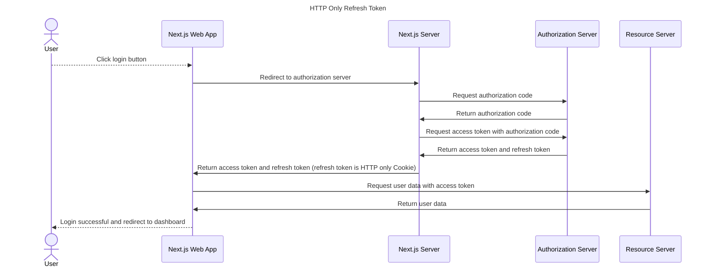

# HTTP Only Refresh Token

Enhance security by storing refresh token in HTTP only cookie.



- Next.js Server will set the refresh token as an HTTP only cookie.
- Next.js Server keep client-secret and client-id in local config file.

## Environment Variables

### Server-side (NOT exposed to browser)

These are used by Next.js API routes to securely exchange tokens. Do NOT prefix with `NEXT_PUBLIC_`.

```bash
OAUTH2_TOKEN_ENDPOINT=https://your-auth-server.com/oauth2/token
OAUTH2_CLIENT_SECRET=your-client-secret
```

### Client-side (exposed to browser)

These are used by the frontend for initiating the OAuth2 flow. Prefixed with `NEXT_PUBLIC_`.

```bash
NEXT_PUBLIC_OAUTH2_AUTHORIZATION_URL=https://your-auth-server.com
NEXT_PUBLIC_OAUTH2_CLIENT_ID=your-client-id
NEXT_PUBLIC_OAUTH2_SCOPE=openid profile email
NEXT_PUBLIC_OAUTH2_REDIRECT_URI=http://localhost:3074/login/oauth2-code
NEXT_PUBLIC_NXMARKET_API=https://your-api-server.com
```

## API Routes

| Endpoint | Method | Description |
|----------|--------|-------------|
| `/api/auth/token` | POST | Exchange authorization code for tokens. Sets refresh token as HTTP-only cookie. |
| `/api/auth/refresh` | POST | Refresh access token using HTTP-only cookie. |
| `/api/auth/logout` | POST | Clear HTTP-only refresh token cookie. |
